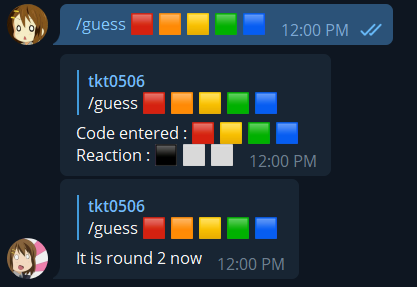

# Mastermind_Bot #

## Play mastermind at telegram ! ##

 

[bot invite link](https://t.me/tkt_test_2_bot)

## set up ##
1. ```pip install -r requirements.txt```
2. ```python main.py```

## how to use the bot ##
1. Use /open to open a room
2. Use /start_game to start a game 
3. Use /guess to guess the code peg
4. End the game by using /end
5. Close the room by using /close

## Command available: ##
- /help - show this message  
- /open - open a room 
- /join <room num> - join a room 
- /kick <name> - kick player in room 
- /start_game <name> - start a game (bot : bot pick , ran : random select) 
- /guess - guess a code pegs 
- /end - end a game  
- /leave - leave a room 
- /close - close a room 
- /stats - show player stats 
- /board <num> - show leaderboard 

## Credit ##
- [rain2wood](https://github.com/rain2wood) for giving suggestion and inspiration
- [CCN0807](https://github.com/CCN0807) for giving suggestion and help testing game
- [telebot](https://github.com/eternnoir) for using the api service
- [pymongo](https://github.com/mongodb) for accessing the mongodb